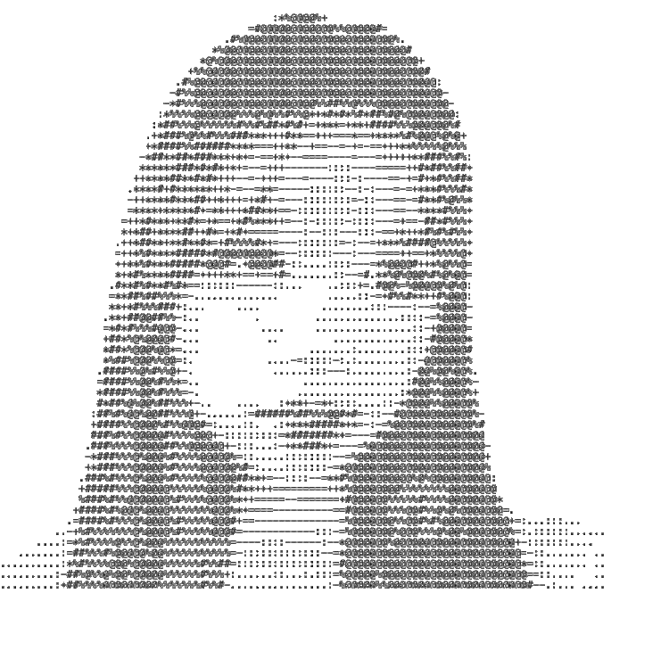

  <picture>
    <source media="(prefers-color-scheme: dark)" srcset="src/Header-dark-mode.GIF">
    
  </picture>

 

<picture>
  <source media="(prefers-color-scheme: dark)" srcset="src/ASCII-black-bg-padded.GIF">
  
</picture>

### 🌱 Currently working on…

- *SnuffleStudy*: A Chrome extension that brings real accountability to **virtual study rooms**.
- *Nymphase*: **Track your period**, journal your emotions, and log your habits.
- *Reverielle*: **Build a full outfit**, head to toe, using your calendar, closet, and personal style.
- *Compositwin*: Connect playlists and jams through **Spotify and Apple Music** accounts.

### 🛠️ Skills

- **Languages:** TypeScript, JavaScript, Python, HTML/CSS
- **Frameworks & Libraries:** Tailwind, React, React Native, Flutter
- **Tools & DevOps:** GitHub Actions, XCode, Blender, Figma

 

  
  &nbsp;&nbsp;
  
  &nbsp;&nbsp;
  
  &nbsp;&nbsp;
  

 

  <picture>
    <source media="(prefers-color-scheme: dark)" srcset="https://github-readme-streak-stats.herokuapp.com/?user=chloewychan&theme=dark&hide_border=true&ring=F9A49B&fire=F9A49B&currStreakLabel=F9A49B">
    
  </picture>

  

